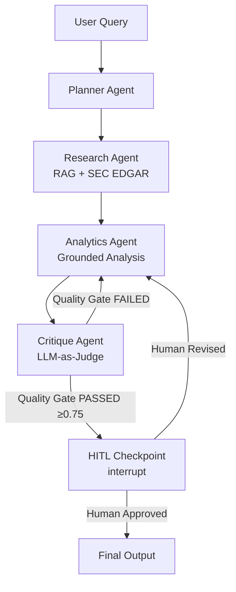

# System Architecture

## Agent Graph Flow


## Infrastructure

| Component | Demo Config | Production Config |
|-----------|------------|-------------------|
| LLM | Groq llama-3.3-70b | Azure OpenAI gpt-4o |
| Vector Store | Chroma local | Qdrant Cloud |
| Checkpointer | SQLite | PostgreSQL |
| Storage | Local filesystem | Cloudflare R2 |
| Database | Supabase | Azure Cosmos DB |
| Observability | Langfuse | Azure Monitor |
| Experiment Tracking | DagsHub MLflow | Azure ML |
| Backend | Render free tier | Azure Container Apps |
| Frontend | Streamlit Community Cloud | Vercel |

## Key Design Decisions

### HITL Interrupt Pattern
```python
# State persisted to SQLite before interrupt()
# Graph resumes from exact state after human approval
human_input = interrupt(interrupt_payload)
```

### Provider Abstraction
```python
# Swap LLM provider by changing one env variable
LLM_PROVIDER=groq      # Demo — free
LLM_PROVIDER=azure     # Production — enterprise
```

### Quality Gates
- **Critique Agent**: LLM-as-Judge scores faithfulness (0.4w), coherence (0.3w), task completion (0.3w)
- **RAGAS Pipeline**: faithfulness ≥ 0.75 required — gates CI/CD pipeline
- **DeepEval**: GEval groundedness, task completion, coherence — gates every PR

## Repository Structure
```
langgraph-task-orchestrator/
├── agents/          # Planner, Research, Analytics, Critique, HITL, Supervisor
├── graph/           # LangGraph StateGraph assembly
├── tools/           # LangChain tool definitions (SEC EDGAR search)
├── core/            # LLM client, retriever, observability, MLflow tracker
├── data/            # SEC EDGAR ingestion pipeline
├── evaluation/      # RAGAS pipeline + DeepEval quality gates
├── api/             # FastAPI backend with WebSocket streaming
├── ui/              # Streamlit dashboard
├── tests/           # Unit + integration tests (real SEC data)
├── docs/            # Architecture documentation
└── .github/         # CI/CD workflows + PR template
```